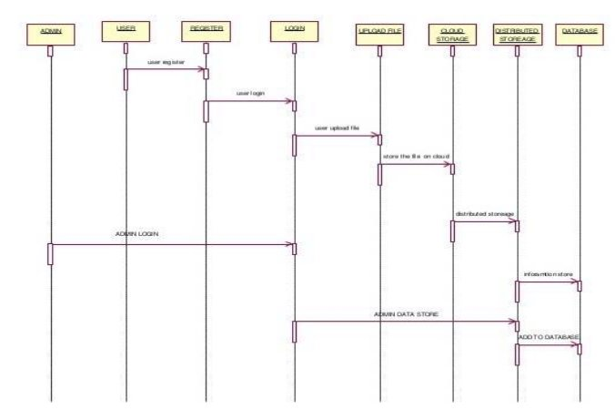
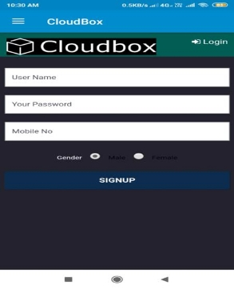
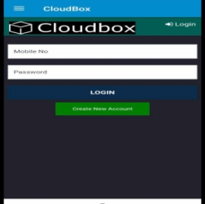
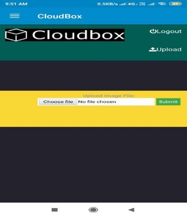
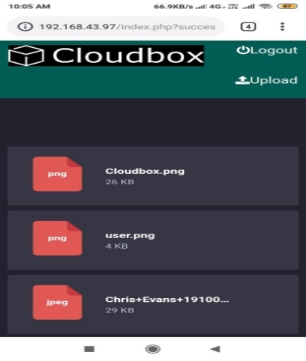

*Project Report* 

*On*             **“CLOUD BOX”** 

**Submitted to*** 

**Rajiv Gandhi Proudyogiki Vishwavidyalaya, Bhopal  *Partial fulfilment of the degree in*** 

**Bachelor of Engineering            (Computer Science and Engineering)** 

`      `**By** 

`                 `**Deepshikha  Patel                              Kaushal Sen  Prashant Tripathi                       0223CS161006                      0223CS161011     0223CS161020** 

`                                                                      `**B.E. VI Semester** 

**Department of Computer Science & Engineering** *Under the Guidance of* 

**Asst. Prof. Prakriti Kapoor                   Department of Computer Science & Engineering** 

**Department of Computer Science & Engineering, St. Aloysius Institute of Technology, Jabalpur    Session 2018 - 2019** 

**DECLARATION***  

I hereby declare that the present Dissertation work **“Cloud Box”** is original work carried out under the guidance  of  **Asst.  Prof.  Prakriti  Kapoor**  Department of  Computer  Science,  **St.  Aloysius  Institute  of Technology,  Jabalpur**.  It  has  not  been  submitted  by  me  in  part  or  full  to  any  University  for  any examination  before.  This  work  has  been  carried  out  by  me  at  the  Rajiv  Gandhi  Proudyogiki Vishwavidyalaya during the academic session 2018 - 2019. 

Date:                                                    

**Deepshikha Patel 0223CS161006**

`           `**Kaushal Sen** 

**0223CS161011**

`    `**Prashant Tripathi 0223CS161020**

`                                                                      `B.E - VI Semester Department of Computer Science & Engineering 

St. Aloysius Institute of Technology, Jabalpur 

**CERTIFICATE** 

*This is to certify that the dissertation entitled* **“Cloud Box”** 

*Is a bonafied work and it is submitted to the*  Rajiv Gandhi Proudyogiki Vishwavidyalaya, Bhopal**.** 

*By* 

**Deepshikha Patel   Kaushal Sen  rPrashant Tripathi     0223CS161006  0223CS161011  0223CS161020** 

*In the partial fulfilment of the degree of “***Bachelor of Engineering”** in “**Computer Science and Engineering”**, *during the academic year **2018-2019** under my Guidance.* 

**Asst. Prof. Prakriti Kapoor** 

`       `*Guide**  

`         `*Department of Computer Science* 

iii 

` `**Dr. Sudeep Sharma** 

*Head* 

Department of Computer Science & Engineering 

 **Dr. Smita Shrivastava** 

*Principal* 

St. Aloysius Institute of Technology, Jabalpur 

**EXAMINER CERTIFICATE**

*This is to certify that the dissertation on* 

**“Cloud box”**   

*is examined by the following examiners on date     /     /2019.* 

*Internal Examiner                                            External Examiner*** 

**ABSTRACT** 

Cloud computing is now days emerging field because of its performance, high availability, low cost. In the cloud many services are provided to the client by cloud. Data store is main future that cloud service provides to the companies to store huge amount of storage capacity. But still many companies or workstations are not ready to implement cloud computing technology due to lack of proper security control policy and weakness in protection which lead to many challenge in cloud computing. The primary objective of designing this data center or data storage is to learn the importance of accessing our data from anywhere around the world, create  a  secured  &  easy  to  handle  storage  for  a  small  number  of  users,  to  prevent  Data  access  from unauthorized access, and also performs some of the tasks like data updating, deleting, appending. 

**Keyword:** *Cloud computing, Authentication.*

**ACKNOWLEDGEMENT** 

It is a pleasure to acknowledge the assistance of several people and institutions in this effort. Honestly speaking,  this  project  has  turned  us  into  a  debtor.  First  and  foremost,  we  feel  indebted  to our  guide,        **Asst. Prof. Prakriti Kapoor**, Department of Computer Science, S.A.I.T., Jabalpur for his/her valuable guidance, continuous support and advice and constant encouragement throughout our project work.  

A special word of thanks goes to our Director **Dr. Fr. Davis George**, S.A.I.T. for his encouragement to accomplish our work on time. 

We are also grateful to **Dr.Sudeep Sharma** Head, Department of Computer Science, S.A.I.T. Jabalpur, for his last minute instructions which helped us to focus our work in the right direction.

We would like to extend our gratitude to honourable **Dr. Smita Shrivastava Principal S.A.I.T** Jabalpur for being a constant Source of inspiration

Finally, we would like to extend our thanks to all those who have contributed, directly or indirectly to make this project successful.

**Deepshikha Patel 0223CS161006 Kaushal Sen 0223CS161011** 

` `**Prashant Tripathi** 

**0223CS161020**   B.E. – CSE 

VI Semester

**List of Figures** 

**S. No.  Name of Figure  Fig. No.** 

1. Data Flow Diagram  3.1 
1. Activity Diagram  3.2 
1. Use - Case Diagram  3.3 
1. Sequence Diagram  3.4 
1. Collaboration Diagram  3.5 
1. ER Diagram  3.6 
1. Sign Up Page  4.1 
1. Login Page  4.2 
1. File Upload Page  4.3 
1. Document Stored Page  4.4 

viii 

**Table of Contents** 

**S. No.  Contents  Page No.** 

Title Page  i Declaration of the Student  ii Certificate of the Guide  Ii Examiner Certificatte  iv Abstract  v 

Acknowledgement  vi List of Figures  vii 

1. **INTRODUCTION  1** 
1. Problem Definition  1 
1. Hardware Specification  1 
1. Software Specification  1 
1. Technology Used  2 
2. **LITERATURE SURVEY  3** 
1. Existing System  3 
1. Survey  3 
1. Proposed System  4 
3. **SYSTEM ANALYSIS & DESIGN  5** 
1. Requirement Specification\* (page-2)  5 
1. Flowcharts / DFDs / ERDs  5 
4. **RESULTS / OUTPUTS  9** 
4. **CONCLUSIONS / RECOMMENDATIONS  11** 
4. **REFERENCES  12** 

1. **INTRODUCTION** 
1. **Problem Definition** 

Traditional storage platforms such as hard disks or other kinds of physical storage devices have long lost their sheen. The days when these physical storage devices ruled the technology world is long gone and people are shifting towards the more advanced and attractive technical option of cloud for storing their files and data. 

Cloud storage becomes an increasing attraction in cloud computing paradigm, which enables users to store their data and access them wherever and whenever they need using any device in a pay-as-you-go manner . 

From the perspective of data security, which has always an important aspect of quality of service, Cloud computing and data storage inevitably poses new challenging security threats. The data stored in the cloud may  be  frequently updated by the users including  insertion, deletion, modification, appending, reordering,etc.  

2. **Hardware Specification**  
1. Processor: Intel Core i3
1. Primary Memory: 4 GB
1. Hard Disk: 1 TB
1. Operating System: Windows 7 and up
1. The above specified requirements are the minimum required to run the application
3. **Software Specification** 
1. Database: MySQL 
1. Web Browser: Chrome or Firefox 
1. Tools used 
1. Android  Studio  V3.2  -  Android  Studio  is  the  official  IDE  for  Android development, and includes everything you need to build Android app.[5]
1. SketchWare IDE V3.9.2 - Sketchware lets you build mobile apps using lego- like blocks. Block language lets you go beyond prebuilt widgets, allowing your application to be flexible and scalable.[4]
1. Sublime  Text  Editor  V3.1.9  -  It  natively  supports  many  programming languages and markup languages, and functions can be added by users with plugins,  typically  community-built  and  maintained  under  free-software licenses. 
4. **Technology Used** 
1. For Web-based application 
1. HTML5**-**  HTML5  is  a  new  version  of the  language  HTML,  with  new elements, attributes, and behaviors, and a larger set of technologies that allows the  building  of  more  diverse  and  powerful  Web  sites  and  applications. It extends, improves and rationalizes the markup available for documents, and introduces markup and application programming interfaces (APIs) for complex web applications.
1. CSS3**-**  CSS3  is  the  latest  evolution  of  the  Cascading  Style  Sheets language.  It  brings  a  lot  of  long-awaited  novelties,  like  rounded  corners, shadows, gradients, transitions or animations, as well as new layouts like multi- columns, flexible box or grid layout.
1. JavaScript- JavaScript runs on the client side of the web, which can be used to design / program how the web pages behave on the occurrence of an event.
1. PHP-  PHP is a server-side scripting  language designed specifically  for web development. PHP can be easily embedded in HTML files and HTML codes can also be written in a PHP file.
1. MySQL-  MySQL  is  the  most  popular  Open  Source  Relational  SQL Database Management System. MySQL is one of the best RDBMS being used for developing various web-based software applications.
2. For Android application 
1. XML-  Extensible Markup Language (XML) is a markup language that defines a set of rules for encoding documents in a format that is both human- readable and machine-readable. The design goals of XML focus on simplicity,  generality  and  usability across the Internet.  It  is a textual data format with strong support via Unicode for different human language.
1. Java-  Java  is  used  in  a  wide  variety  of  computing  platforms  from embedded  devices  and  mobile  phones  to  enterprise  servers  and supercomputers. Java applets, which are  less common than standalone Java applications,  were  commonly  run  in  secure,  sandboxed  environments  to provide  many  features  of  native  applications  through  being  embedded  in HTML pages. 
2. **LITERATURE SURVEY** 
1. **Existing System** 
1. Google Drive- This is a „pure‟ cloud computing service, with all the apps and storage found online. It is a file storage and synchronization service developed by Google. It allows users to store files on their servers, synchronize files across devices, and share files.  You  can  use  it  via  desktop  top  computers,  tablets  like  the  iPad  or  on smartphones. All of Google's services could be considered cloud computing really: Gmail,  Google  Calendar,  Google  Reader,  Google  Voice,  and  so  on.  Microsoft‟s OneDrive is very similar to Google Drive and offers much the same services.[2]
1. Dropbox- Dropbox Commonly used by boys and staff to store their documents and images. You might set your phone to automatically send all pictures you take with it into your Dropbox account, so that even if you lose your phone, the pictures will still be available to you up in space; you might use it to access your documents at home, and then save changes to it.[2]
1. Amazon Cloud Drive Storage at the big retailer is mainly for music – and they would certainly prefer it is music that you have bought from them.[2]

Common Features:- 

- Both are third party services.  
- They offer a basic amount of free storage: –  
- Dropbox: 5 GB  
- Google Drive (linked to Gmail account): 15 GB  

• After that, the user has to pay a yearly or monthly subscription fee. E.g. Google Drive: 100 GB - $4.99/month; 200 GB - $9.99/month 

2. **Survey** 

2.2.1  **Research Paper-** An Approach for Data Storage Security in Cloud Computing written  by  Deepanchakaravarthi  Purushothaman  and  Dr.Sunitha  Abburu. Published in IJCSI, Vol.9, Issue 2, No. 1 [1]

Cloud computing is the most demanding and emerging technology throughout the world. Cloud computing is an Internet based computer technology. The major thing  that  a  computer  does  is  to  store  in  the  available  space  and  retrieve information  whenever  requested  by  the  authenticated  user.  It  also  allows developer to access the highly scalable, reliable, secure, fast, inexpensive,  infrastructure that Amazon uses to run its own global network of web sites. From the  viewpoint of data  security, which  has always been an  important aspect of quality of service, Cloud Computing unavoidably poses new challenging security threats for number of reasons. 

- Unauthenticated person don‟t attack the authorized file 
- Avoids Collusion attacks 
- Malicious data modification attack 
- Dynamic data operations 
3. **Proposed System- Cloud Box** 

Features:- 

- User Interface 
  - Simple User Interface to use  
  - Easy storing, retrieval and updating of data  
- Data Security 
  - Data will be secured as data is stored directly in database as BLOB datatype. 
- File Types 
  - All types of data files can be stored  
  - Different file types will have different tags for proper segregation. 
- Navigation  
  - It offer a directory structure; this facilitates navigation and organization easily 
- Sharing 
  - File Sharing through WhatsApp 
- File versioning 
- Files versioning is maintained for every single file stored in the cloud for a period of 30 days. Users could track the changes performed on the file and also can find the date and time at which the change was performed. 
3. **SYSTEM ANALYSIS**
1. **System Requirements** 
1. Hardware Requirements– Refer Page 1 
1. Software Requirements- Refer Page 1 
1. Technology Used- Refer Page 2 
2. **Applicable Diagrams**   
1. Data  Flow  Diagram:  *A  two-dimensional  diagram  that  shows  how  data  is processed and transferred in a system***.** *The graphical depiction identifies each source of data and how it interacts with other data sources to reach a common output.* 

Fig. 3.1 Data Flow Diagram  

2. Activity  Diagram:  *Activity  diagram  is  a  loosely  defined  diagram  to  show workflows of stepwise activities and actions, with support for choice, iteration and concurrency.  UML,  activity  diagrams  can  be  used  to  describe  the  business  and operational step-by-step workflows of components in a system.* 

Fig. 3.2 Activity Diagram 

3. Use Case Diagram: *A use case diagram is a type of behavioural diagram created from a Use-case analysis. The purpose of use case is to present overview of the functionality  provided  by  the  system  in  terms  of  actors,  their  goals  and  any dependencies between those use case. User register login file upload to cloud server key response to user cloud server* 

Fig. 3.3 Use - Case Diagram 

4. Sequence Diagram: *A sequence diagram in UML is a kind of interaction diagram that  shows  how  processes  operate  with  one  another  and  in  what  order.  It  is  a* 

*construct of a message sequence chart. Sequence diagrams are sometimes called* 

*Event-trace diagrams, event scenarios, and timing diagrams*. 

Fig. 3.4 Sequence Diagram 

5. Collaboration  Diagram:  *A  collaboration  diagram  shows  the  objects  and relationships involved in an interaction, and the sequence of messages exchanged among  the  objects  during  the  interaction.  The  collaboration  diagram  can  be  a decomposition of a class, class diagram, or part of a class diagram. It can be the decomposition of a use case, use case diagram, or part of a use case diagram *

Fig. 3.5 Collaboration Diagram 

6. Entity – Relationship Diagram: 

Fig. 3.6 ER Diagram 

4. **RESULTS** 

**4.1 Display View** 

Fig. 4.1 Sign Up Page 

**
` `Fig. 4.2 Login Page 

Fig. 4.3 File Upload Page 

Fig. 4.4 Document Stored Page 

5. **CONCLUSION & FUTURE ENHANCEMENTS** 

This project report briefly explained the problems of data security in cloud data storage and also provided a way out to ensure user correctness. We believe that data storage security in Cloud Computing, an area of challenges and of dominant significance,  is still  in  its  infancy to  be identified. We envision several possible directions  for future research on this area. It allows Third Parity Auditor to audit the cloud data storage without demanding users‟ time, probability. 

- We have successfully designed a cloud based storage software – CloudBox.  
- We can have access to our stored data at any time, at any place with Internet Access. 
- CloudBox  is  currently  in  testing  phase  (*Unit  testing  done,  Module  testing  done, Integration testing done*) where only a limited number of users can have access. 

In this report we proposed a key generator method for security proof to avoid hacking in cloud infrastructure. The key generated by service provider regarding user queries will send to their respective registered login id. In the existing ones the key will be displayed to the user and hence there is a chance for hacking user details. To avoid such circumstances, the user must get their details with their respective key generated by the service provider. 

6. **REFERENCES** 
1. Deepanchakaravarthi Purushothaman and Dr.Sunitha Abburu, “An Approach for Data Storage Security in Cloud Computing” Published in IJCSI, Vol.9, Issue 2, No. [http://ijcsi.org/papers/IJCSI-9-2-1-100-105.pdf ](http://ijcsi.org/papers/IJCSI-9-2-1-100-105.pdf)
1. Will Williams and Phil,”Cloud Storage”,SlideShare, [https://www.slideshare.net/willwilliams7/cloud-storage-32243654 ](https://www.slideshare.net/willwilliams7/cloud-storage-32243654)
1. “Cloud Storage”,Wikipedia  [https://en.m.wikipedia.org/wiki/Cloud_storage ](https://en.m.wikipedia.org/wiki/Cloud_storage)
1. SketchWare IDE  [https://docs.sketchware.io/ ](https://docs.sketchware.io/)
1. Android Studio [https://developer.android.com/studio/archive ](https://developer.android.com/studio/archive)
12 
